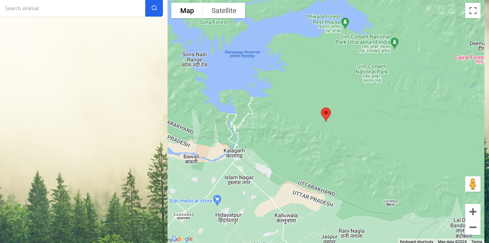
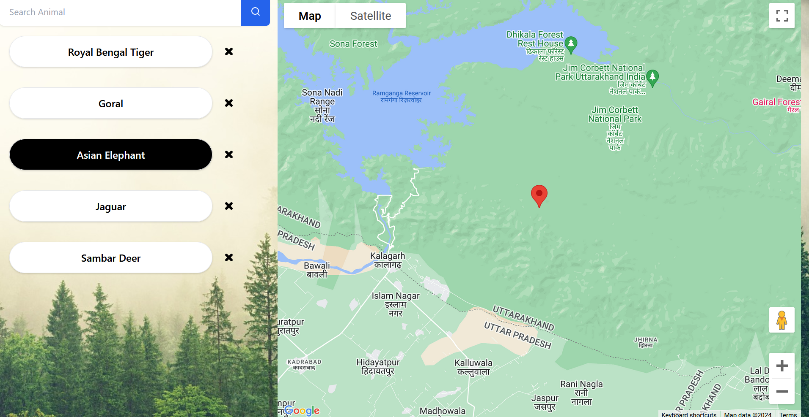
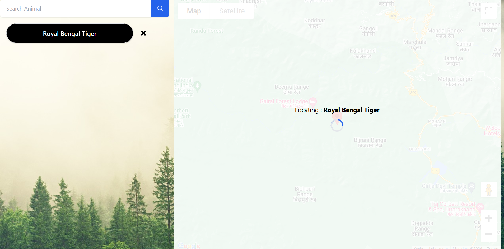

# Into the Wild

Into the Wild is a Vue 3 web application for exploring a curated list of wildlife species on an interactive Google Map. Users can search for animals, add them to a shortlist, and view their locations with simulated live updates on the map.

## Features

- Search across 25+ animal species
- Add and remove animals from a shortlist
- View animal locations on an interactive Google Map
- Simulate small live location updates for the selected animal
- Responsive layout built with Tailwind CSS
- Shared component state handled through a custom reactive `EventBus`

## Tech Stack

- Vue 3
- JavaScript
- Tailwind CSS
- Google Maps JavaScript API
- `vue3-google-map`

## Project Structure

```text
into-the-wild/
├── public/
├── src/
│   ├── assets/
│   ├── components/
│   │   ├── HomePage.vue
│   │   ├── MapViewer.vue
│   │   ├── SearchBox.vue
│   │   └── animalList.json
│   ├── App.vue
│   ├── EventBus.js
│   ├── index.css
│   └── main.js
├── package.json
└── tailwind.config.js
```

## Getting Started

### Prerequisites

- Node.js
- npm
- A Google Maps API key with `Maps JavaScript API` enabled

### Installation

1. Clone the repository:

```bash
git clone https://github.com/Voltac209/into-the-wild.git
cd into-the-wild-main/into-the-wild
```

2. Install dependencies:

```bash
npm install
```

3. Create a `.env` file in `into-the-wild/`:

```bash
VUE_APP_API_KEY=your_google_maps_api_key
```

4. Start the development server:

```bash
npm run serve
```

5. Open:

```text
http://localhost:8080
```

## Build for Production

```bash
npm run build
```

The production build output is generated in `into-the-wild/dist/`.

## Usage

1. Type an animal name into the search box.
2. Choose a result from the dropdown or submit the search.
3. Add animals to the shortlist shown beside the map.
4. Click a shortlisted animal to center the map on it.
5. Watch the marker continue to shift slightly over time to simulate live movement.

## Screenshots

### Home Page



### Shortlist View



### Map Location View



## Deployment

This project can be deployed as a static site. For Render:

- Root directory: `into-the-wild`
- Build command: `npm install && npm run build`
- Publish directory: `dist`
- Environment variable: `VUE_APP_API_KEY`

## Notes

- Do not commit your `.env` file or API key.
- Restrict your Google Maps API key by HTTP referrer for deployed environments.
- `dist/` should be treated as generated build output.

## Future Improvements

- Add multiple moving markers at once
- Persist selected animals between sessions
- Replace static JSON data with a backend data source
- Add clustering or region-based filtering

## License

This project is licensed under the [MIT License](./LICENSE).
